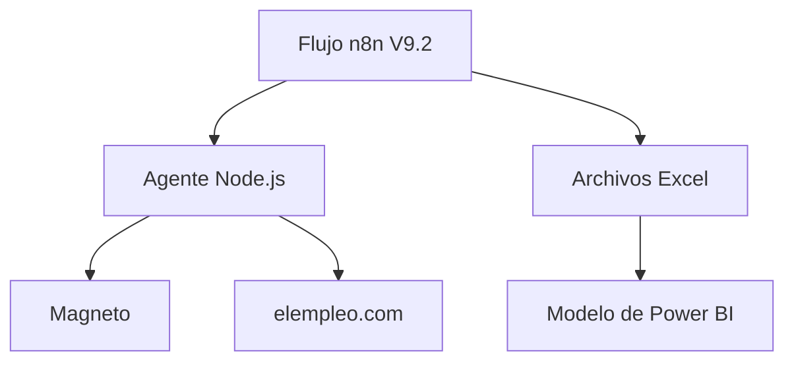

# Agente estratégico de vacantes multifuente

Sistema institucional para recopilar, normalizar y analizar ofertas laborales relacionadas con las áreas estratégicas de la Universidad de Ibagué. La solución integra **Magneto** y **elempleo.com**, genera archivos de control y publica un modelo estructurado para Power BI.

## Estado del proyecto

Versión estable actual: **V9.2**

La V9.2 corrige las conexiones entre las ramas de Magneto y elempleo.com en n8n. El flujo completo contiene **24 nodos** y utiliza el servidor estable V9.1 para manejar fallas temporales de red.

Resultado de la ejecución validada el 9 de septiembre de 2026:

| Indicador | Resultado |
|---|---:|
| Consultas ejecutadas | 63 |
| Consultas exitosas | 63 |
| Consultas fallidas | 0 |
| Vacantes únicas | 1.133 |
| Vacantes de Magneto | 643 |
| Vacantes de elempleo.com | 490 |
| Empresas únicas | 337 |
| Áreas estratégicas | 18 |
| Salarios publicados | 716 |
| Modalidades publicadas | 730 |
| Relaciones rotas en el modelo | 0 |

> Los resultados son una fotografía de la ejecución indicada y cambiarán en cada actualización.

## Objetivo

Apoyar el análisis institucional de demanda laboral mediante información consolidada sobre:

- Cargos y empresas contratantes.
- Áreas y subáreas estratégicas.
- Nivel ocupacional.
- Tipo de contrato.
- Modalidad presencial, híbrida o remota.
- Salario mínimo y máximo publicado.
- Ubicación y cobertura regional.
- Fuente de la vacante.
- Posibles coincidencias entre portales.

## Fuentes laborales

| Fuente | Estado | Consultas por ejecución |
|---|---|---:|
| Magneto | Activa | 38 |
| elempleo.com | Activa | 25 |
| APE SENA | No integrada | El portal restringió el acceso automatizado durante el piloto |

La solución no intenta evadir controles de acceso. Solo procesa información pública disponible para el agente local.

## Arquitectura



El servicio `agente` realiza la navegación, interpreta las ofertas y construye el modelo. n8n organiza las consultas, espera la terminación de ambas fuentes, consolida los resultados y guarda los archivos en OneDrive.

## Tecnologías

- Docker Desktop y Docker Compose.
- n8n 2.36.8.
- Node.js 24.
- Express 5.2.1.
- ExcelJS 4.4.0.
- agent-browser.
- Microsoft Excel.
- Microsoft Power BI Desktop.
- OneDrive institucional.

## Estructura recomendada del repositorio

```text
agente-vacantes/
├── agente/
│   ├── Dockerfile
│   ├── package.json
│   ├── server.js
│   └── model-builder.js
├── n8n/
│   └── flujo_vacantes_multifuente_v9_2.json
├── compose.yaml
└── README.md
```

Los archivos Excel generados y las copias históricas no deberían almacenarse en GitHub. Se recomienda agregarlos a `.gitignore` porque contienen resultados variables de las ejecuciones.

## Requisitos

Antes de desplegar el proyecto se necesita:

1. Windows 10 u 11.
2. Docker Desktop en ejecución.
3. PowerShell.
4. Acceso a internet.
5. La carpeta institucional de salida:

```text
C:\Users\Unibague\OneDrive - unibague.edu.co\Agente_Scraping
```

6. Power BI Desktop para consumir el modelo generado.

## Despliegue desde PowerShell

### 1. Abrir la carpeta del proyecto

```powershell
cd C:\despliegue_n8n_agente
```

### 2. Construir e iniciar los servicios

```powershell
docker compose up -d --build
```

Para realizar una reconstrucción limpia del agente:

```powershell
docker compose build --no-cache agente
docker compose up -d --force-recreate agente
```

### 3. Comprobar los contenedores

```powershell
docker compose ps
```

Los contenedores esperados son:

- `agente-scraping-unibague`: debe aparecer como `healthy`.
- `n8n-unibague`: debe aparecer como `Up`.

### 4. Verificar el servidor

```powershell
docker compose exec agente node -e "fetch('http://localhost:3000/').then(r=>r.json()).then(console.log)"
```

La respuesta debe incluir:

```text
Servidor de scraping V9.1 multifuente estable funcionando
```

## Configuración de n8n

1. Abrir `http://localhost:5678`.
2. Seleccionar **Import from File**.
3. Importar `n8n/flujo_vacantes_multifuente_v9_2.json`.
4. Abrir **Agente estratégico V9.2 - Magneto y elempleo.com (conexiones corregidas)**.
5. Confirmar que aparezcan **24 nodos**.
6. Guardar el flujo.

La V9.2 incorpora el nodo `Esperar ramas Magneto`, que garantiza que el control de consultas de Magneto termine antes de consolidar las dos fuentes.

## Ejecución manual

Antes de ejecutar:

1. Cerrar los archivos Excel generados si están abiertos.
2. Confirmar que no exista otra ejecución activa o en cola.
3. No ejecutar simultáneamente versiones anteriores del flujo.
4. Presionar **Execute workflow** una sola vez.

La ejecución completa puede tardar entre 60 y 100 minutos. Todos los nodos deben terminar en verde.

## Archivos generados

La carpeta `Agente_Scraping` recibe tres archivos oficiales:

| Archivo | Contenido |
|---|---|
| `control_consultas.xlsx` | Estado y métricas de las 63 consultas |
| `vacantes_estrategicas.xlsx` | Base consolidada de vacantes |
| `Modelo_Estructurado_Vacantes_PowerBI.xlsx` | Modelo relacional para Power BI |

Las copias fechadas se conservan en:

```text
Agente_Scraping\Historico
```

El archivo oficial de Power BI no se reemplaza si persiste alguna consulta fallida.

## Modelo de datos

El libro `Modelo_Estructurado_Vacantes_PowerBI.xlsx` contiene:

| Tabla | Función |
|---|---|
| `Fact_Vacantes` | Una fila por vacante y fuente |
| `Fact_Ejecuciones` | Resultado de cada consulta y página |
| `Dim_Areas` | Áreas estratégicas y cobertura regional |
| `Dim_Consultas` | Catálogo de consultas |
| `Dim_Nivel_Ocupacional` | Clasificación de niveles laborales |
| `Dim_Modalidad` | Modalidades de trabajo |
| `Dim_Fuentes` | Portales de empleo |
| `Dim_Ubicaciones` | Ubicaciones normalizadas |
| `Bridge_Vacante_Area` | Relación de vacantes con áreas |
| `Bridge_Vacante_Consulta` | Relación de vacantes con consultas |

Relaciones principales:

```text
Dim_Fuentes[fuente_portal] 1 → * Fact_Vacantes[fuente_portal]
Dim_Ubicaciones[ubicacion_id] 1 → * Fact_Vacantes[ubicacion_id]
Dim_Modalidad[modalidad_trabajo] 1 → * Fact_Vacantes[modalidad_trabajo]
Dim_Nivel_Ocupacional[nivel_ocupacional] 1 → * Fact_Vacantes[nivel_ocupacional]
```

Las relaciones de áreas y consultas se realizan mediante sus tablas puente.

## Conexión con Power BI

El archivo utilizado como fuente debe ser:

```text
C:\Users\Unibague\OneDrive - unibague.edu.co\Agente_Scraping\Modelo_Estructurado_Vacantes_PowerBI.xlsx
```

Después de una ejecución validada, abrir el archivo `.pbix` y seleccionar **Inicio → Actualizar**.

Medidas recomendadas:

```DAX
Total Vacantes =
DISTINCTCOUNT(Fact_Vacantes[vacante_id])
```

```DAX
Total Empresas =
DISTINCTCOUNT(Fact_Vacantes[empresa])
```

Para evitar que las tarjetas muestren textos como `1,133 mil`, configurar **Unidades de visualización = Ninguno** y **Decimales = 0**.

Columna calculada para normalizar contratos:

```DAX
Contrato normalizado =
SWITCH(
    Fact_Vacantes[contrato],
    "Término indefinido", "Indefinido",
    "Indefinido", "Indefinido",
    "Definido", "Término fijo",
    "Término fijo", "Término fijo",
    "Prestacion de Servicios", "Prestación de servicios",
    "Prestación de servicios", "Prestación de servicios",
    "jobOffers.contractType.unknown", "No informado",
    Fact_Vacantes[contrato]
)
```

## Validaciones de calidad

Antes de actualizar Power BI, comprobar:

- 63 registros en `control_consultas.xlsx`.
- 38 consultas de Magneto y 25 de elempleo.com.
- Cero consultas con estado `Fallida`.
- Ausencia de identificadores de vacante duplicados dentro de cada fuente.
- Igualdad entre el número de filas de `vacantes_estrategicas.xlsx` y `Fact_Vacantes`.
- Cero relaciones rotas entre hechos, dimensiones y tablas puente.

Las coincidencias entre portales se conservan para mantener la trazabilidad de cada fuente. El campo `posible_duplicado_entre_fuentes` permite identificarlas.

## Tolerancia a fallos

- Comprobación de DNS antes de consultar Magneto.
- Hasta tres reintentos para errores transitorios de DNS, conexión y tiempo de espera.
- Procesamiento controlado de las consultas de Magneto.
- Espera explícita de las ramas de ambas fuentes antes de consolidar.
- Archivo de control independiente.
- Bloqueo del reemplazo del modelo oficial cuando una consulta falla.
- Copias históricas fechadas para recuperación.

## Solución de problemas

### El agente no aparece como `healthy`

```powershell
docker compose ps
docker compose logs agente --tail 100
```

Si el contenedor conserva una versión anterior:

```powershell
docker compose build --no-cache agente
docker compose up -d --force-recreate agente
```

### El nodo `Generar modelo Power BI` falla

Revisar `control_consultas.xlsx`. El agente bloquea la generación cuando existen consultas fallidas para proteger el archivo oficial.

### Aparece `Control de consultas Magneto hasn't been executed`

Importar el flujo V9.2 y confirmar que tenga 24 nodos. La versión corregida incluye `Esperar ramas Magneto`.

### Windows indica que el archivo Excel está en uso

Cerrar Excel y Power BI antes de repetir el guardado. No ejecutar nuevamente el flujo mientras la ejecución anterior continúe activa.

### Revisar conectividad desde el agente

```powershell
docker compose exec agente node -e "require('dns').promises.lookup('www.magneto365.com').then(x=>console.log('DNS OK:',x.address)).catch(e=>console.error('DNS ERROR:',e.message))"
```

```powershell
docker compose exec agente node -e "fetch('https://www.magneto365.com/co/trabajos/ofertas-empleo-en-ibague').then(r=>console.log('MAGNETO HTTP:',r.status)).catch(e=>console.error('ERROR:',e.message))"
```

## Operación segura

- Mantener los portales y volúmenes limitados al uso necesario para el proyecto.
- No almacenar contraseñas, tokens ni archivos `.env` en GitHub.
- Respetar las condiciones de uso, restricciones técnicas y límites de los portales consultados.
- Evitar ejecuciones simultáneas o intervalos excesivamente cortos.
- Revisar periódicamente los campos sin información y los posibles duplicados entre fuentes.

## Próximos pasos

- Programar la ejecución semanal en n8n.
- Configurar la actualización programada del modelo en Power BI Service.
- Incorporar nuevas fuentes únicamente cuando permitan acceso técnico y uso responsable.
- Crear indicadores de calidad, cobertura regional y evolución temporal.
- Mejorar la comparación de vacantes publicadas en varios portales.
- Documentar los responsables institucionales de operación, revisión y publicación.

## Uso institucional

Proyecto desarrollado para apoyar los análisis de la Dirección de Planeación de la Universidad de Ibagué. Antes de publicar el repositorio de forma abierta, se recomienda definir la licencia, revisar las condiciones de las fuentes y confirmar que no se incluyan archivos de datos, credenciales o información interna.
